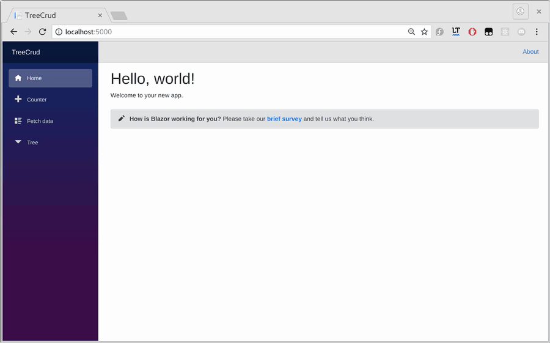

# Blazor Tree CRUD

A simple Server-Side Blazor CRUD app to deal with hierarchical data.

Project has a data layer with GraphQL for R (Retrieve) and classical Rest for CUD (Create Update Delete)

The basic functionality is ready:

* Unexpand nodes and expand nodes with Lazy load.
* Select and unselect a node.
* Insert new nodes
* ToDo: Update, Delete

> Backend by [@utrescu](https://github.com/utrescu/) Frontend by [@ctrl-alt-a](https://github.com/ctrl-alt-d).

### Screenshot ( because all us love screenshots ):



### Show me the code

```
    <UITreeComponent SourceData=@uiTree
                     SelectChangeDelegate=@OnSelectionChanged
                     LazyLoadNodesAsyncDelegate=@LoadNodes
                     CollapseAsyncDelegate=@OnCollapse
                     ExpandAsyncDelegate=@OnExpand
                     TriggerActionAsyncDelegate=@OnAction>
    </UITreeComponent>  

@functions {

    UITree uiTree = new UITree();
    
    private async Task<bool> OnExpand(int Id)
    {
        System.Console.WriteLine("Expanded " + Id);
        return await Task.FromResult(true);
    }

```

### How to run?

1. Launch GraphQL server: `( cd TreeCrud.Server/; dotnet run )`
2. Launch Blazor Server: `( cd TreeCrud.GraphQL/; ASPNETCORE_URLS="http://127.0.0.1:6000" dotnet run  )`


### Can I use `UITreeComponent` on my project?

Use it as your risk. Steps:

* Download the project.
* Add a reference to it from your own project.
* Add the following line in your `_ViewImports.cshtml`:  `@addTagHelper *, BlazorTreeControl` 
* Please, PR your improvements and Issue for comments.

Don't hesitate to contact me for further information :)

